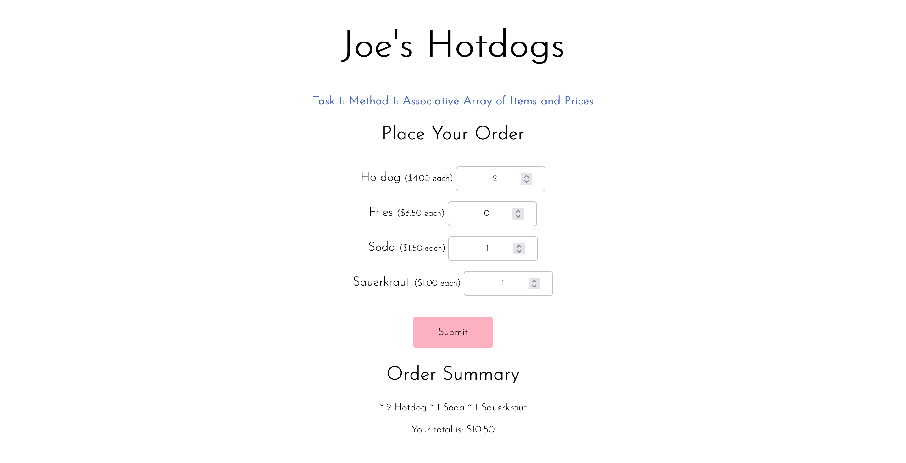

# dgmd-e-28-assignment-3

## Task 1

### Method 1: Associative Array of Items and Prices

- [x] Present the order choices to the user
- [x] Get the order quantities desired for each item
- [x] Calculate the order total
- [x] Display the order plus the total

